<p align="center">
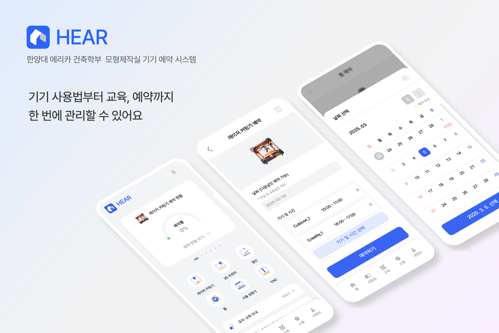
</p>

<h1>
 
HEAR
</h1>

> HYU ERICA Architecture Reservation<br/>
> <b>한양대학교 에리카 건축학부 모형제작실 기기 예약 시스템</b>

- 1인 개발 프로젝트 (기획, 디자인, 프론트엔드, 백엔드)
- 2024.08 ~ 진행중
- [백엔드 repository 링크](https://github.com/JeonggonCho/HEAR-BE)

<br/>

## 1. 프로젝트 소개

### 🔍 개요

<p align="center">
<br/>
<span>문제점 - 수기 예약 방식</span>
</p>

한양대 에리카 건축학과에서 대학원 조교로서 모형제작실 관리 업무를 맡았었으며, 모형제작실을 이용하려는 학생들에게 `예약을 수기`로
받고 있다. 따라서 매일 아침마다 예약 신청서를 게시하고 저녁에 수거해서 예약 현황을 정리 해야하는 번거로움이 있었으며, 
학생들도 마찬가지로 예약을 하기 위해 오픈런을 하는 상황도 발생했다. 뿐만 아니라 예약하고 기기를 이용하기 위해서는 교육을 이수해야 하는데 교육의 경우 구글폼을 이용했다.
기기에 문제가 발생하는 등의 문제와 같이 학생들에게 공지해야 할 부분이 있을 경우에도 즉각적인 전달이 쉽지 않았다.

### 😡 문제점

```
1. 수기 예약 방식의 비효율성
2. 매일 예약 신청서 관리
3. 교육은 구글폼으로 진행
4. 공지사항 전달의 어려움
```

### 👍 목표

예약에 대한 `유저 경험이 좋지 않았으며` 이러한 문제를 해결하기 위해 `모형제작실의 예약, 교육, 커뮤니케이션`을 한번에 쉽게 관리 할 수 있는 예약 시스템을 만들어 보기로 하였다.

<br>
<br>

## 2. 프로젝트 환경 설정

<details>
<summary>프로젝트 환경 설정 가이드 (클릭하여 펼치기)</summary>
<div markdown="1">

- 서버와 DB, 환경변수가 설정되어야 합니다

1. `git clone` 진행

```bash
https://github.com/JeonggonCho/HEAR-FE.git
```

<br/>

2. 라이브러리 설치

- 라이브러리 버전으로 오류가 발생할 수 있습니다

```bash
$ npm install
```

<br/>

3. 로컬에서 프로젝트 실행하기

```bash
$ npm run dev
```
</div>
</details>

<br>
<br>

## 3. 커밋 컨벤션

- commit -m '커밋 타입 : 커밋 설명'

| 타입       | 의미             |
|----------|----------------|
| add      | 새로운 컴포넌트 추가    |
| feat     | 새로운 기능 추가      |
| refactor | 기능 변화 없이 코드 수정 |
| style    | UI 및 스타일 수정    |
| fix      | 에러 및 이슈, 버그 해결 |
| docs     | 문서 작성          |
| chore    | 기타 수정          |

<br>
<br>

## 4. 주요 기능

### 🙋🏻 회원
- 회원가입 (한양대 이메일 검증)
- 로그인 및 로그아웃 (JWT 활용)
- 회원 프로필
- 역할(학생, 조교, 관리자)에 따른 권한 분리
  - `학생` : 예약하기, 문의하기, 피드백 작성 등의 권한
  - `조교 및 관리자` : 공지사항 작성, 유저 관리, 기기 관리, 예약 관리 등의 권한

### 📖 온보딩(사용법)
- 기기(레이저 커팅기, 3D 프린터, 열선, 톱, 사출 성형기, CNC)의 이용 규칙, 사용법 등을 안내

### ✏️ 교육(퀴즈)
- 기기를 이용 권한을 위한 교육 진행
  - 문제 유형은 주관식, 객관식 모두 포함
- 교육에서 커트라인 점수 이상 획득 시, 이용 권한 부여

### 📆 예약
- 기기 별로 예약의 규칙이 상이하며 이에 따라서 예약 진행
  - 기본적으로 교육 이수 학생에 한하여 예약 가능
  - 자세한 이용 규칙 및 사용 수칙들은 온보딩(사용법) 페이지에 상세히 안내
  - 간단한 규칙은 아래와 같음
    - `레이저 커팅기` : 1회 신청에 1시간 사용 / 1일 최대 2회, 1주일 최대 4회까지 예약 가능(예약 가능 횟수 리셋 자동화) ...
    - `3D 프린터` : 기기 당 1명 씩, 하루 8시간 이용 가능 ...
    - `열선` : 설계 스튜디오 당 1대 씩, 일주일 대여 가능(동일한 스튜디오 학생들을 동시에 예약 처리) ...
    - `톱` : 안전 장비 착용 후 이용 ...
    - `사출 성형기` : 권장 재료만 이용 가능 ...
    - `CNC` : 4학년 이상, 조교 판단 하에 이용 가능 ...

### 💬 커뮤니티
- 공지사항, 문의, 피드백, 댓글 작성 가능
  - `공지사항` : 모형제작실 관한 주요 사항 공지
  - `문의` : 학생들이 조교에게 문의 사항 요청
  - `피드백` : 유저(학생, 조교)들이 관리자(개발자)에게 예약 시스템에 대한 피드백 전달

### 📍 관리
- `학생` : 내 예약, 이용 내역, 문의 내역, 경고 내역
- `조교 및 관리자` : 예약 관리, 유저 관리, 기기 관리, 교육(퀴즈) 관리

### ⚙️ 시스템 설정
- 테마(다크모드, 라이트모드) 및 다국어(한국어, 영어, 중국어) 설정을 지원

<br/>
<br/>

## 5. 개발 환경

### Frontend

<h3 style="display: flex; align-items: center; gap: 6px">

React (v18.2.0)
</h3>

- 컴포넌트 기반의 구조를 통해 인터랙티브한 UI 개발에 유리하다. 
- 가상 DOM과 SPA를 사용하여 업데이트와 렌더링을 효율적으로 처리할 수 있다.

<h3 style="display: flex; align-items: center; gap: 6px">

Vite
</h3>

- 개발 서버의 빠른 시작과 핫 모듈 교체(HMR)를 제공하여 개발 속도에 유리하다.
- 번들링 과정을 최소화하여 개발 중에 즉각적인 피드백을 받을 수 있다.

<h3 style="display: flex; align-items: center; gap: 6px">

Emotion
</h3>

- CSS-in-JS로, 스타일을 컴포넌트와 함께 관리할 수 있게 해준다.
- 코드의 재사용성과 유지보수성을 높여주며 성능 최적화와 동적 스타일링이 용이하다.

<h3 style="display: flex; align-items: center; gap: 6px">

zod
</h3>

- TypeScript와 함께 사용하면 데이터 타입을 검증하는 데 매우 유용하다.
- 스키마 정의가 직관적이고, 런타임에서도 타입 검증을 통해 안정성을 높일 수 있다.

<h3 style="display: flex; align-items: center; gap: 6px">

react-hook-form
</h3>

- TypeScript 지원과 함께 폼의 상태 관리를 최소화하면서도 성능을 최적화 할 수 있다.

<h3 style="display: flex; align-items: center; gap: 6px">

react-beautiful-dnd
</h3>

- 드래그 앤 드롭 인터페이스를 구현할 때, 이 라이브러리는 사용성이 뛰어나고, 애니메이션과 상호작용이 부드럽게 동작하도록 한다.
- 복잡한 드래그 앤 드롭 로직을 쉽게 관리할 수 있다.

<h3 style="display: flex; align-items: center; gap: 6px">

react-helmet-async
</h3>

- 이 라이브러리는 동적 메타 태그 관리를 통해 SEO에 도움을 준다.
- 비동기적으로 작동하여 성능 저하 없이 페이지를 업데이트할 수 있다.

<h3 style="display: flex; align-items: center; gap: 6px">

swiper
</h3>

- 모바일에서 데스크탑까지 다양한 환경에서 작동하는 슬라이더 컴포넌트를 제공한다.
- 커스터마이징이 용이하고, 다양한 터치 이벤트와 애니메이션을 지원한다.

<h3 style="display: flex; align-items: center; gap: 6px">

Zustand
</h3>

- 상태 관리 라이브러리로, Redux보다 간편하게 코드를 작성하고 상태를 관리할 수 있다.

<br/>

### Backend

<h3 style="display: flex; align-items: center; gap: 6px">

Express.js
</h3>

- Node.js 위에서 빠르고 간편하게 서버를 구축할 수 있는 프레임워크로 라우팅, 미들웨어, 모델 사용이 용이하여 RESTful API를 쉽게 만들 수 있다.

<h3 style="display: flex; align-items: center; gap: 6px">

mongoDB / mongoose
</h3>

- 스키마가 없는 NoSQL 데이터베이스로, 유연한 데이터 구조를 필요로 하는 애플리케이션에 적합하다.
- Mongoose는 MongoDB와의 상호작용을 쉽게 하고, 스키마 검증을 통해 데이터 무결성을 보장한다.

<h3 style="display: flex; align-items: center; gap: 6px">

bcrypt.js
</h3>

- 비밀번호 보안에 필수적인 해시 함수들을 제공하며 암호화된 비밀번호 저장 및 인증 과정에서 안전성을 확보할 수 있다.

<h3 style="display: flex; align-items: center; gap: 6px">

nodemailer
</h3>

- 이메일 발송 기능을 간편하게 구현할 수 있는 라이브러리로, 다양한 이메일 서비스와 통합이 용이하다.
- SMTP를 통해 이메일을 보낼 수 있다.
- SMTP(Simple Mail Transfer Protocol) : 인터넷을 통해 이메일을 주고받기 위해 사용되는 프로토콜

<h3 style="display: flex; align-items: center; gap: 6px">

agenda
</h3>

- 작업 예약과 실행을 관리하는 데 유용하다.
- MongoDB와 통합하여 백그라운드 작업을 예약하고, 반복적인 작업을 처리할 수 있다.

<br/>

### Deployment

<h3 style="display: flex; align-items: center; gap: 6px">

S3
</h3>

- 정적 웹사이트 호스팅에 최적화되어 HTML, CSS, JS 파일을 쉽게 배포할 수 있다.
- 사용량 기반으로 과금이 되며, 안정적인 스토리지를 이용할 수 있다.

<h3 style="display: flex; align-items: center; gap: 6px">
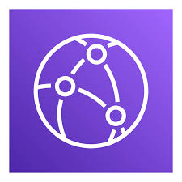
CloudFront
</h3>

- CDN(Content Delivery Network)을 활용해 엣지 로케이션에 빠른 컨텐츠 전송이 가능하다.
- 리소스 캐싱을 통해 서버의 부담을 최소화 할 수 있다.
- HTTPS를 지원하여 보안을 강화할 수 있다.

<br/>
<br/>

[//]: # (## 5. ERD 모델 설계)

[//]: # ()
[//]: # (<br/>)

[//]: # (<br/>)

[//]: # ()
[//]: # (## 6. 목업 디자인)

[//]: # ()
[//]: # (<br/>)

[//]: # (<br/>)

## 6. 프로젝트 구조

<details>
<summary>프로젝트 구조 보기 (클릭하여 펼치기)</summary>
<div markdown="1">

```
src
 ├─ api
 │ ├─ auth
 │ │ ├─ fetchUserApi.ts
 │ │ ├─ fetchWarningsApi.ts
 │ │ ├─ findPasswordApi.ts
 │ │ ├─ signInApi.ts
 │ │ ├─ signUpApi.ts
 │ │ ├─ unregisterUserApi.ts
 │ │ ├─ updatePasswordApi.ts
 │ │ └─ updateUserApi.ts
 │ ├─ comment
 │ │ └─ commentApis.ts
 │ ├─ education
 │ │ └─ educationApis.ts
 │ ├─ feedback
 │ │ ├─ createFeedbackApi.ts
 │ │ ├─ deleteFeedbackApi.ts
 │ │ ├─ fetchFeedbackApi.ts
 │ │ ├─ fetchFeedbacksApi.ts
 │ │ └─ updateFeedbackApi.ts
 │ ├─ inquiry
 │ │ ├─ createInquiryApi.ts
 │ │ ├─ deleteInquiryApi.ts
 │ │ ├─ fetchInquiriesApi.ts
 │ │ ├─ fetchInquiryApi.ts
 │ │ └─ updateInquiryApi.ts
 │ ├─ machine
 │ ├─ notice
 │ ├─ reservation
 │ └─ axiosInstance.ts
 │
 ├─ components
 │ ├─ account
 │ │ ├─ DeleteAccount
 │ │ ├─ FindPasswordForm
 │ │ ├─ LogoutAccount
 │ │ ├─ ProfileCard
 │ │ ├─ SignInForm
 │ │ ├─ SignUpForm
 │ │ ├─ StatusCard
 │ │ ├─ UpdateAccount
 │ │ ├─ UpdateAssistantAccountForm
 │ │ ├─ UpdatePassword
 │ │ ├─ UpdatePasswordForm
 │ │ ├─ UpdateStudentAccountForm
 │ │ └─ WarningList
 │ ├─ comment
 │ │ ├─ CommentDropdown
 │ │ ├─ CommentListItem
 │ │ ├─ Comments
 │ │ ├─ DeleteComment
 │ │ ├─ LikeComment
 │ │ └─ UpdateComment
 │ ├─ common
 │ │ ├─ ArrowBack
 │ │ ├─ ArrowForward
 │ │ ├─ Backdrop
 │ │ ├─ BottomSheet
 │ │ │ ├─ BasicBottomSheet.tsx
 │ │ │ ├─ BottomSheetBody.tsx
 │ │ │ ├─ BottomSheetHeader.tsx
 │ │ │ ├─ BottomSheetPortal.tsx
 │ │ │ └─ BottomSheetTrigger.tsx
 │ │ ├─ Button
 │ │ ├─ Calendar
 │ │ ├─ Card
 │ │ ├─ Carousel
 │ │ ├─ Chart
 │ │ ├─ ChatBubble
 │ │ ├─ Divider
 │ │ ├─ Dropdown
 │ │ │ ├─ DropdownItem.tsx
 │ │ │ ├─ DropdownMenu.tsx
 │ │ │ ├─ DropdownTrigger.tsx
 │ │ │ └─ MoreDropdown.tsx
 │ │ ├─ EmailVerification
 │ │ ├─ Empty
 │ │ ├─ ErrorBoundary
 │ │ │ ├─ GlobalErrorBoundary.tsx
 │ │ │ └─ LocalErrorBoundary.tsx
 │ │ ├─ Flex
 │ │ ├─ FloatingButton
 │ │ ├─ Gallery
 │ │ ├─ Grid
 │ │ ├─ HeadTag
 │ │ ├─ Header
 │ │ │ ├─ HeaderCenter.tsx
 │ │ │ ├─ HeaderLeft.tsx
 │ │ │ └─ HeaderRight.tsx
 │ │ ├─ Icon
 │ │ ├─ Image
 │ │ ├─ Input
 │ │ ├─ InputMessage
 │ │ ├─ Label
 │ │ ├─ Link
 │ │ ├─ LoadingLoop
 │ │ ├─ Modal
 │ │ │ ├─ ConfirmModal.tsx
 │ │ │ ├─ MapModal.tsx
 │ │ │ ├─ ModalBody.tsx
 │ │ │ ├─ ModalFooter.tsx
 │ │ │ ├─ ModalHeader.tsx
 │ │ │ ├─ ModalPortal.tsx
 │ │ │ └─ ModalTrigger.tsx
 │ │ ├─ Nav
 │ │ ├─ ProfileImage
 │ │ ├─ ProgressBar
 │ │ ├─ ScrollToTop
 │ │ ├─ Select
 │ │ ├─ SideMenu
 │ │ ├─ Tab
 │ │ ├─ Textarea
 │ │ ├─ Timer
 │ │ ├─ Toast
 │ │ ├─ Toggle
 │ │ └─ UserInfoModal
 │ │ │ └─ UserInfoModalContent.tsx
 │ ├─ education
 │ │ ├─ EducationListItem
 │ │ ├─ EducationSideMenuContent
 │ │ ├─ GradingAnswerListItem
 │ │ ├─ ResetEducation
 │ │ └─ SubmitEducation
 │ ├─ feedback
 │ │ ├─ CreateFeedbackForm
 │ │ ├─ DeleteFeedback
 │ │ ├─ FeedbackDropdown
 │ │ ├─ FeedbackList
 │ │ ├─ InquiryFeedbackListItem
 │ │ ├─ LikeFeedback
 │ │ ├─ UpdateFeedback
 │ │ └─ UpdateFeedbackForm
 │ ├─ home
 │ │ ├─ AssistantCard
 │ │ ├─ CafeSiteCard
 │ │ ├─ CncReservationConditionContent
 │ │ ├─ FeedbackCard
 │ │ ├─ HeatReservationConditionContent
 │ │ ├─ HomeHeader
 │ │ ├─ LaserReservationConditionContent
 │ │ ├─ NoticeCard
 │ │ ├─ PrinterReservationConditionContent
 │ │ ├─ ReservationCard
 │ │ ├─ SawReservationConditionContent
 │ │ └─ VacuumReservationConditionContent
 │ ├─ inquiry
 │ │ ├─ CreateInquiryForm
 │ │ ├─ DeleteInquiry
 │ │ ├─ InquiryDropdown
 │ │ ├─ InquiryList
 │ │ ├─ LikeInquiry
 │ │ ├─ UpdateInquiry
 │ │ └─ UpdateInquiryForm
 │ ├─ management
 │ │ ├─ AddMachine
 │ │ ├─ DeleteMachine
 │ │ ├─ DeleteUser
 │ │ ├─ EducationManagementEndDateSetting
 │ │ ├─ EducationManagementMenu
 │ │ ├─ EducationManagementMenuContent
 │ │ ├─ EducationManagementSave
 │ │ ├─ EducationManagementSideMenu
 │ │ ├─ EducationManagementStartDateSetting
 │ │ ├─ HandoverUser
 │ │ ├─ MachineListItem
 │ │ ├─ MachineManageCard
 │ │ ├─ NewMachineContent
 │ │ ├─ OptionListContent
 │ │ ├─ OptionListItem
 │ │ ├─ QuestionListContent
 │ │ ├─ QuestionListItem
 │ │ ├─ TimeListContent
 │ │ ├─ TimeListItem
 │ │ ├─ UsersManagementFilter
 │ │ └─ UsersManagementFilterContent
 │ ├─ notice
 │ │ ├─ DeleteNotice
 │ │ ├─ NoticeDropdown
 │ │ └─ NoticeListItem
 │ ├─ reservation
 │ │ ├─ CncReservationForm
 │ │ ├─ CncSelect
 │ │ ├─ CncSelectBottomSheetContent
 │ │ ├─ DeleteReservation
 │ │ ├─ DeleteSelectedReservations
 │ │ ├─ LaserSelect
 │ │ ├─ LaserSelectBottomSheetContent
 │ │ ├─ PrinterSelectContent
 │ │ ├─ ReservationListItem
 │ │ ├─ RoomMap
 │ │ ├─ SawReservationForm
 │ │ ├─ SawSelect
 │ │ ├─ SawSelectBottomSheetContent
 │ │ ├─ VacuumReservationForm
 │ │ ├─ VacuumSelect
 │ │ └─ VacuumSelectBottomSheetContent
 │ └─ skeleton
 │   └─ CardLoading
 │
 ├─ constants
 │ ├─ instruction
 │ │ ├─ cncInstruction.ts
 │ │ ├─ heatInstruction.ts
 │ │ ├─ laserInstruction.ts
 │ │ ├─ printerInstruction.ts
 │ │ ├─ sawInstruction.ts
 │ │ └─ vacuumInstruction.ts
 │ ├─ buttonCategories.ts
 │ ├─ calendarCategories.ts
 │ ├─ cardCategories.ts
 │ ├─ educationCategories.ts
 │ ├─ feedbackCategories.ts
 │ ├─ filterCategories.ts
 │ ├─ headerCategories.ts
 │ ├─ inputCategories.ts
 │ ├─ inquiryCategories.ts
 │ ├─ machineCategories.ts
 │ ├─ messageCategories.ts
 │ ├─ navCategories.ts
 │ ├─ pageDescriptionCategories.ts
 │ ├─ placeholderCategories.ts
 │ └─ regex.ts
 │
 ├─ context
 │ ├─ CommentContext.ts
 │ ├─ EducationContext.ts
 │ ├─ EducationManagementContext.ts
 │ ├─ UsersManagementContext.ts
 │ └─ UsersManagementFilterContext.ts
 │
 ├─ hooks
 │ ├─ useAuth.ts
 │ ├─ useCheckbox.ts
 │ ├─ useDebounce.ts
 │ ├─ useDropdown.ts
 │ ├─ useListCollapse.ts
 │ ├─ useModal.ts
 │ ├─ useRequest.ts
 │ ├─ useRolling.ts
 │ ├─ useScrollbarSize.ts
 │ ├─ useTextarea.ts
 │ └─ useToggle.ts
 │
 ├─ layouts
 │ └─ Layout
 │
 ├─ pages
 │ ├─ auth
 │ │ ├─ AccountPage
 │ │ ├─ FindPasswordPage
 │ │ ├─ MyWarningPage
 │ │ ├─ SettingPage
 │ │ ├─ SignInPage
 │ │ ├─ SignUpDonePage
 │ │ ├─ SignUpPage
 │ │ ├─ ThemeSettingPage
 │ │ ├─ UpdateAccountPage
 │ │ └─ UpdatePasswordPage
 │ ├─ education
 │ │ ├─ EducationEndPage
 │ │ ├─ EducationIntroductionPage
 │ │ └─ EducationStartPage
 │ ├─ feedback
 │ │ ├─ CreateFeedbackPage
 │ │ ├─ FeedbackDetailPage
 │ │ ├─ FeedbackPage
 │ │ └─ UpdateFeedbackPage
 │ ├─ home
 │ │ ├─ HomePage
 │ │ ├─ NotFoundPage
 │ │ ├─ NotificationPage
 │ │ └─ SplashPage
 │ ├─ inquiry
 │ │ ├─ CreateInquiryPage
 │ │ ├─ InquiryDetailPage
 │ │ ├─ InquiryPage
 │ │ ├─ MyInquiriesPage
 │ │ └─ UpdateInquiryPage
 │ ├─ instructions
 │ │ ├─ InstructionPage
 │ │ ├─ cnc
 │ │ │ ├─ InstructionCnc
 │ │ │ ├─ Introduction
 │ │ │ └─ Work
 │ │ ├─ heat
 │ │ │ ├─ InstructionHeat
 │ │ │ └─ Introduction
 │ │ ├─ laser
 │ │ │ ├─ After
 │ │ │ ├─ InstructionLaser
 │ │ │ ├─ Introduction
 │ │ │ ├─ Preparation
 │ │ │ └─ Usage
 │ │ ├─ printer
 │ │ │ ├─ After
 │ │ │ ├─ InstructionPrinter
 │ │ │ ├─ Introduction
 │ │ │ ├─ Preparation
 │ │ │ └─ Usage
 │ │ ├─ saw
 │ │ │ ├─ After
 │ │ │ ├─ InstructionSaw
 │ │ │ └─ Warning
 │ │ ├─ vacuum
 │ │ │ ├─ InstructionVacuum
 │ │ │ ├─ Introduction
 │ │ │ ├─ Preparation
 │ │ │ └─ Usage
 │ │ └─ instruction.style.ts
 │ ├─ management
 │ │ ├─ EducationManagementPage
 │ │ ├─ MachinesManagementPage
 │ │ ├─ ReservationsManagementPage
 │ │ └─ UsersManagementPage
 │ ├─ notice
 │ │ ├─ CreateNoticePage
 │ │ ├─ NoticeDetailPage
 │ │ ├─ NoticePage
 │ │ └─ UpdateNoticePage
 │ └─ reservation
 │   ├─ MyReservationsPage
 │   ├─ MyUsagePage
 │   ├─ ReservationCnc
 │   ├─ ReservationDonePage
 │   ├─ ReservationHeat
 │   ├─ ReservationLaser
 │   ├─ ReservationPrinter
 │   ├─ ReservationSaw
 │   └─ ReservationVacuum
 │
 ├─ routes
 │ ├─ AppRoute.tsx
 │ └─ PrivateRoute.tsx
 │
 ├─ schemata
 │ ├─ BoardSchemaProvider.ts
 │ ├─ EducationSchemaProvider.ts
 │ ├─ MachineSchemaProvider.ts
 │ ├─ QuestionSchemaProvider.ts
 │ ├─ UserSchemaProvider.ts
 │ └─ WarningSchemaProvider.ts
 │
 ├─ store
 │ ├─ useAuthStore.ts
 │ ├─ useErrorStore.ts
 │ ├─ useThemeStore.ts
 │ ├─ useToastStore.ts
 │ └─ useUserStore.ts
 │
 ├─ styles
 │ ├─ emotion.d.ts
 │ ├─ global.ts
 │ └─ theme.ts
 │
 ├─ tests
 │
 ├─ types
 │ ├─ authResponse.ts
 │ ├─ comment.ts
 │ ├─ componentProps.ts
 │ ├─ education.ts
 │ ├─ machine.ts
 │ ├─ navCategory.ts
 │ ├─ reservation.ts
 │ ├─ tab.ts
 │ ├─ user.ts
 │ └─ warning.ts
 │
 ├─ util
 │ ├─ calculateDate.ts
 │ ├─ generateCalendar.ts
 │ ├─ generateLinksAndLineBreaks.ts
 │ ├─ getReservationRate.ts
 │ ├─ getScrollbarSize.ts
 │ ├─ getTimeStamp.ts
 │ ├─ hexToRgb.ts
 │ ├─ isEmailValid.ts
 │ ├─ isNumber.ts
 │ └─ stripHtml.ts
 │
 ├─ App.css
 ├─ App.tsx
 ├─ index.css
 └─ main.tsx
```

</div>
</details>

<br/>
<br/>

## 7. API 명세서


### 🙋🏻 회원

<details>
<summary>API 보기 (클릭하여 펼치기)</summary>
<div markdown="1">

| 기능                       | 메서드    | 요청 url                                   |
|--------------------------|--------|------------------------------------------|
| 프로필 조회                   | GET    | /users/                                  |
| 모든 유저 정보 조회              | GET    | /users/all/                              |
| 조교 정보 조회                 | GET    | /users/assistant/                        |
| 경고 목록 조회                 | GET    | /users/warnings/                         |
| 이메일 중복 확인                | GET    | /users/check-email/                      |
| 특정 유저 정보 조회              | GET    | /users/:userId/                          |
| 이메일 인증번호 전송              | POST   | /users/send-verification-code/           |
| 이메일 인증번호 확인              | POST   | /users/verify-email-code/                |
| 리프레시 토큰 확인 후, 액세스 토큰 재발급 | POST   | /users/refresh-token/                    |
| 회원가입                     | POST   | /users/signup/                           |
| 로그인                      | POST   | /users/login/                            |
| 내 정보 수정                  | PATCH  | /users/                                  |
| 비밀번호 수정                  | PATCH  | /users/password/                         |
| 모든 유저의 경고 초기화            | PATCH  | /users/warning/                          |
| 모든 유저의 교육 이수 초기화         | PATCH  | /users/education/                        |
| 비밀번호 찾기                  | PATCH  | /users/find-password/                    |
| 조교 역할 인수인계               | PATCH  | /users/handover-assistant/:targetUserId/ |
| 경고 부과                    | PATCH  | /users/warning/add/:userId/              |
| 경고 면제                    | PATCH  | /users/warning/minus/:userId/            |
| 교육 이수 처리                 | PATCH  | /users/education/pass/:userId/           |
| 교육 미이수 처리                | PATCH  | /users/education/reset/:userId/          |
| 회원탈퇴(삭제)                 | DELETE | /users/:targetUserId/                    |

</div>
</details>

<br/>

### 💬 문의

<details>
<summary>API 보기 (클릭하여 펼치기)</summary>
<div markdown="1">

| 기능          | 메서드    | 요청 url                      |
|-------------|--------|-----------------------------|
| 모든 문의 목록 조회 | GET    | /inquiries/                 |
| 내 문의 목록 조회  | GET    | /inquiries/me/              |
| 문의 디테일 조회   | GET    | /inquiries/:inquiryId/      |
| 새 문의 작성     | POST   | /inquiries/new/             |
| 문의 좋아요      | POST   | /inquiries/like/:inquiryId/ |
| 문의 수정       | PATCH  | /inquiries/:inquiryId/      |
| 문의 삭제       | DELETE | /inquiries/:inquiryId/      |

</div>
</details>

<br/>

### 🤔 피드백

<details>
<summary>API 보기 (클릭하여 펼치기)</summary>
<div markdown="1">

| 기능           | 메서드    | 요청 url                      |
|--------------|--------|-----------------------------|
| 모든 피드백 목록 조회 | GET    | /feedback/                  |
| 피드백 디테일 조회   | GET    | /feedback/:feedbackId/      |
| 새 피드백 작성     | POST   | /feedback/new/              |
| 피드백 좋아요      | POST   | /feedback/like/:feedbackId/ |
| 피드백 수정       | PATCH  | /feedback/:feedbackId/      |
| 피드백 삭제       | DELETE | /feedback/:feedbackId/      |

</div>
</details>

<br/>

### 📄 공지사항

<details>
<summary>API 보기 (클릭하여 펼치기)</summary>
<div markdown="1">

| 기능            | 메서드    | 요청 url              |
|---------------|--------|---------------------|
| 모든 공지사항 목록 조회 | GET    | /notices/           |
| 최신 공지사항 조회    | GET    | /notices/latest/    |
| 공지사항 디테일 조회   | GET    | /notices/:noticeId/ |
| 새 공지사항 작성     | POST   | /notices/new/       |
| 공지사항 수정       | PATCH  | /notices/:noticeId/ |
| 공지사항 삭제       | DELETE | /notices/:noticeId/ |

</div>
</details>

<br/>

### 📝 댓글

<details>
<summary>API 보기 (클릭하여 펼치기)</summary>
<div markdown="1">

| 기능      | 메서드    | 요청 url                     |
|---------|--------|----------------------------|
| 새 댓글 작성 | POST   | /comments/                 |
| 댓글 좋아요  | POST   | /comments/like/:commentId/ |
| 댓글 수정   | PATCH  | /comments/:commentId/      |
| 댓글 삭제   | DELETE | /comments/:commentId/      |

</div>
</details>

<br/>

### 🛠️ 기기

<details>
<summary>API 보기 (클릭하여 펼치기)</summary>
<div markdown="1">

| 기능               | 메서드    | 요청 url                               |
|------------------|--------|--------------------------------------|
| 기기 활성화 상태 조회     | GET    | /machines/status/                    |
| 레이저 커팅기 정보 조회    | GET    | /machines/lasers/                    |
| 3D 프린터 정보 조회     | GET    | /machines/printers/                  |
| 열선 정보 조회         | GET    | /machines/heats/                     |
| 톱 정보 조회          | GET    | /machines/saws/                      |
| 사출 성형기 정보 조회     | GET    | /machines/vacuums/                   |
| CNC 정보 조회        | GET    | /machines/cncs/                      |
| 레이저 커팅기 시간 정보 조회 | GET    | /machines/lasers/times/              |
| 레이저 커팅기 생성       | POST   | /machines/lasers/                    |
| 3D 프린터 생성        | POST   | /machines/printers/                  |
| 레이저 커팅기 시간 생성    | POST   | /machines/lasers/times/              |
| 레이저 커팅기 시간 수정    | PATCH  | /machines/lasers/times/              |
| 레이저 커팅기 수정       | PATCH  | /machines/lasers/:laserId/           |
| 3D 프린터 수정        | PATCH  | /machines/printers/:printerId/       |
| 열선 수정            | PATCH  | /machines/heats/:heatId/             |
| 톱 수정             | PATCH  | /machines/saws/:sawId/               |
| 사출 성형기 수정        | PATCH  | /machines/vacuums/:vacuumId/         |
| CNC 수정           | PATCH  | /machines/cncs/:cncId/               |
| 레이저 커팅기 삭제       | DELETE | /machines/lasers/:laserId/           |
| 3D 프린터 삭제        | DELETE | /machines/printers/:printerId/       |
| 레이저 커팅기 시간 삭제    | DELETE | /machines/lasers/times/:laserTimeId/ |

</div>
</details>

<br/>

### 📆 예약

<details>
<summary>API 보기 (클릭하여 펼치기)</summary>
<div markdown="1">

| 기능                        | 메서드    | 요청 url                  |
|---------------------------|--------|-------------------------|
| 모든 예약 현황 조회               | GET    | /reservations/all/      |
| 레이저 커팅기 기기 당 예약 가능 시간 조회  | GET    | /reservations/lasers/   |
| 3D 프린터 예약 현황 조회           | GET    | /reservations/printers/ |
| 열선 예약 현황 조회               | GET    | /reservations/heats/    |
| 톱 예약 현황 조회                | GET    | /reservations/saws/     |
| 사출 성형기 예약 현황 조회           | GET    | /reservations/vacuums/  |
| CNC 예약 현황 조회              | GET    | /reservations/cncs/     |
| 내 예약 내역 조회                | GET    | /reservations/me/       |
| 내 이용 내역 조회                | GET    | /reservations/history/  |
| 레이저 커팅기 예약                | POST   | /reservations/lasers/   |
| 3D 프린터 예약                 | POST   | /reservations/printers/ |
| 열선 예약                     | POST   | /reservations/heats/    |
| 톱 예약                      | POST   | /reservations/saws/     |
| 사출 성형기 예약                 | POST   | /reservations/vacuums/  |
| CNC 예약                    | POST   | /reservations/cncs/     |
| 예약 취소                     | DELETE | /reservations/          |

</div>
</details>

<br/>

### ✏️ 교육(퀴즈)

<details>
<summary>API 보기 (클릭하여 펼치기)</summary>
<div markdown="1">

| 기능                     | 메서드   | 요청 url                     |
|------------------------|-------|----------------------------|
| 교육 문제 및 설정 조회          | GET   | /education/                |
| 교육 설정 조회               | GET   | /education/settings/       |
| 교육 문제 조회               | GET   | /education/questions/      |
| 유저의 테스트 응시 가능 여부 확인 조회 | GET   | /education/status/         |
| 유저의 테스트 결과 확인          | GET   | /education/result/         |
| 답안 제출                  | POST  | /education/check/          |
| 교육 문제 저장               | PATCH | /education/                |
| 교육 문제 게시 또는 비게시        | PATCH | /education/implementation/ |
| 교육 커트라인 문제 개수 설정       | PATCH | /education/cut-off-point/  |
| 교육 날짜 설정               | PATCH | /education/date/           |

</div>
</details>

<br>
<br>

## 8. 개발 화면

### 스플래쉬 페이지 / 홈 페이지

| Splash                                                                                                          | 홈                                                                                                                            |
|-----------------------------------------------------------------------------------------------------------------|------------------------------------------------------------------------------------------------------------------------------|
|  |                   |
| - 일정시간 이후, 페이드 아웃<br/>- session storage를 사용하여 초기에만 표시                                                           | - 기기 예약 현황 확인 가능<br/>- 기기 아이콘 클릭으로 예약 페이지 이동<br/>- 최근 공지사항 확인 가능<br/>- 조교 정보 카드 표시<br/>- 학과 카페 사이트(불꽃건축) 링크<br/>- 피드백 작성 링크  |

<br/>

### 회원 페이지

| 로그인                                                                                                           | 회원가입                                                                                                            | 비밀번호 찾기                                                                                                                       |
|---------------------------------------------------------------------------------------------------------------|-----------------------------------------------------------------------------------------------------------------|-------------------------------------------------------------------------------------------------------------------------------|
|  |  |  |
| - 실시간 유효성 검사를 통해 한양대 이메일만 이용 가능                                                                               | - nodemailer를 이용한 한양대 이메일 인증<br/>- 학생 정보 입력                                                                     | - 기존 비밀번호 제거 후, 새 비밀번호를 이메일로 전송                                                                                               |

| 학생 프로필                                                                                                                            | 조교 프로필                                                                                                                                | 회원정보 수정                                                                                                                         |
|-----------------------------------------------------------------------------------------------------------------------------------|---------------------------------------------------------------------------------------------------------------------------------------|---------------------------------------------------------------------------------------------------------------------------------|
|  | 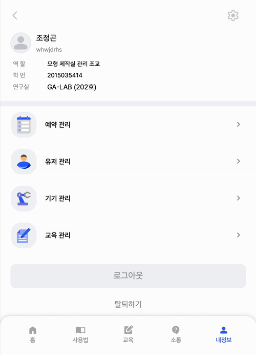 |  |
| - 기본 정보 및 교육 이수 현황, 경고 횟수 확인 가능<br/>- 내 예약, 이용 내역, 문의 내역, 경고 내역 확인 가능                                                             | - 조교 기본 정보 확인 가능<br/>- 예약, 유저, 기기, 교육의 관리 기능 제공                                                                                       | - 이름, 학번, 전화번호 수정 가능                                                                                                            |

| 테마 및 언어 설정                                                                                                        |
|-------------------------------------------------------------------------------------------------------------------|
|  |
| - local storage를 이용하여 설정 관리<br/>- 라이트모드와 다크모드 테마 지원<br/>- 교환학생을 고려해 한국어, 영어, 중국어 지원                               |

<br/>

### 온보딩(사용법) 페이지

| 사용법 목록                                                                                                                              | 사용법                                                                                                                       | 이미지 뷰어                                                                                                                                         |
|-------------------------------------------------------------------------------------------------------------------------------------|---------------------------------------------------------------------------------------------------------------------------|------------------------------------------------------------------------------------------------------------------------------------------------|
| 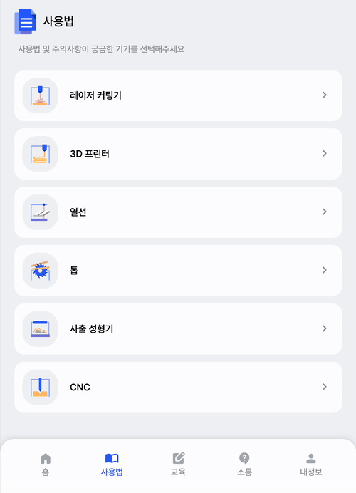 |  |  |
| - 모형 제작실 기기 6종에 대한 이용 수칙 및 주의사항 안내                                                                                                  | - 기기에 대한 세부 정보를 볼 수 있으며 탭을 통해 분류                                                                                          | - 이미지 클릭 시, 뷰어 창 열림<br/>- 확대 및 축소, 크기 초기화 기능 제공                                                                                                |

<br/>

### 예약 페이지

| 레이저 커팅기 예약                                                                                                                            | 3D 프린터 예약 | 열선 예약 |
|---------------------------------------------------------------------------------------------------------------------------------------|-----------|-------|
| 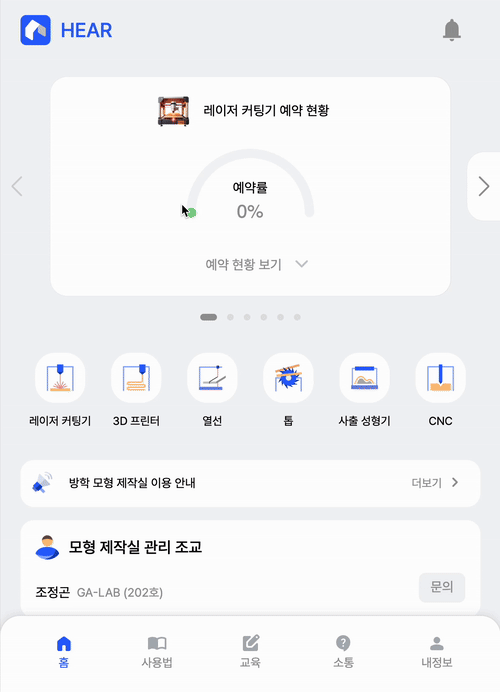 |           |       |
| - 기기 및 시간을 선택<br/>- 최대 일일 2회 / 주 4회 예약 가능                                                                                             |           |       |

| 톱 예약                                                                                                                              | 사출 성형기 예약                                                                                                                               | CNC 예약                                                                                                                            |
|-----------------------------------------------------------------------------------------------------------------------------------|-----------------------------------------------------------------------------------------------------------------------------------------|-----------------------------------------------------------------------------------------------------------------------------------|
|  | 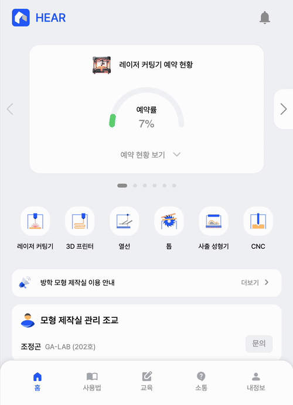 | 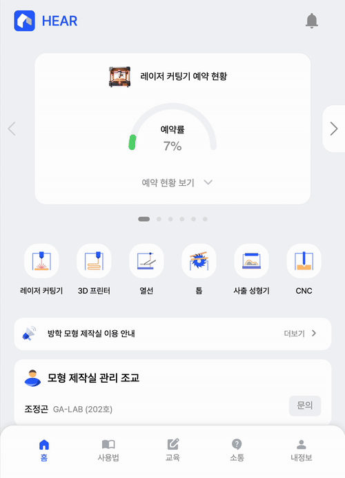 |
| - 날짜 선택<br/>- 시작 시간과 종료 시간을 설정<br/>- 시작 시간이 종료 시간의 이전이 되도록 검사<br/>- 시간은 조교에 의해 변경 될 수 있음을 안내                                      | - 날짜 선택<br/>- 시작 시간과 종료 시간을 설정<br/>- 시작 시간이 종료 시간의 이전이 되도록 검사<br/>- 시간은 조교에 의해 변경 될 수 있음을 안내                                            | - 4학년 이상만 이용 가능함을 확인시킴<br/>- 달력 컴포넌트로 날짜 선택<br/>- 유저가 4학년 이상이 아닌 경우, 예약 불가능                                                       |

<br/>

### 소통 페이지(공지사항, 문의, 피드백)

| 공지사항 작성                                                                                                                         | 공지사항                                                                                                                          |
|---------------------------------------------------------------------------------------------------------------------------------|-------------------------------------------------------------------------------------------------------------------------------|
| 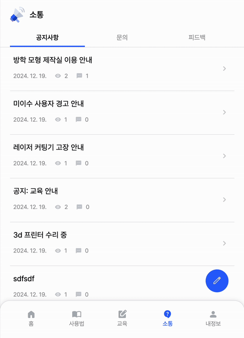 | 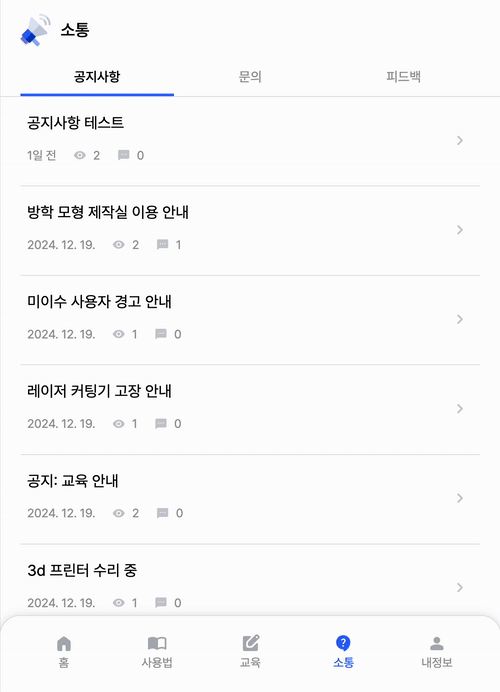 |
| - 제목과 본문 작성 가능<br/>- 본문은 최소 10자 이상 작성하도록 실시간 검사                                                                                 | - 공지사항 제목과 본문을 확인 가능<br/>- 댓글 작성 기능<br/>- 댓글 좋아요 기능                                                                           |

| 문의 및 피드백 작성                                                                                                                         | 문의 및 피드백                                                                                                                        |
|-------------------------------------------------------------------------------------------------------------------------------------|---------------------------------------------------------------------------------------------------------------------------------|
| 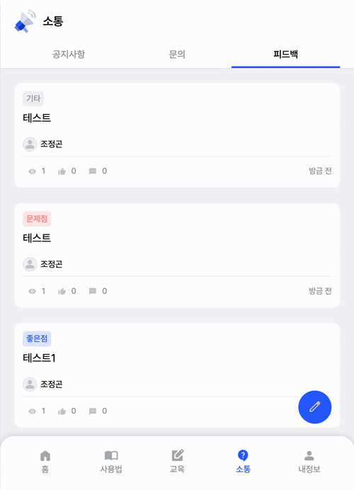 | 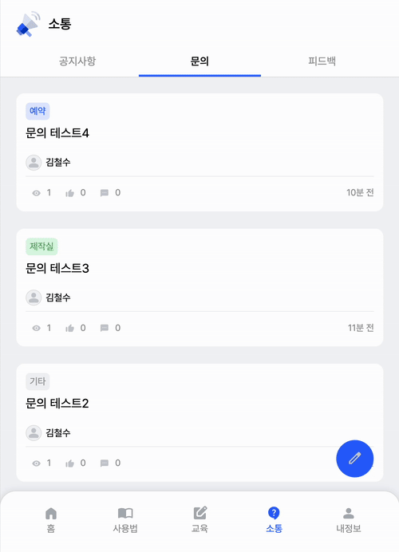 |
| - 제목과 카테고리, 본문을 작성 가능<br/>- 본문은 최소 10자 이상 작성하도록 실시간 검사                                                                              | - 문의 / 피드백의 제목과 본문 확인 가능<br/>- 댓글 작성 기능<br/>- 댓글 좋아요 기능                                                                         |

<br/>

### 교육(퀴즈) 페이지

| 교육(퀴즈) 소개                                                                                                                         | 퀴즈 풀기                                                                                                                 | 퀴즈 제출 및 결과                                                                                                                        |
|-----------------------------------------------------------------------------------------------------------------------------------|-----------------------------------------------------------------------------------------------------------------------|-----------------------------------------------------------------------------------------------------------------------------------|
| 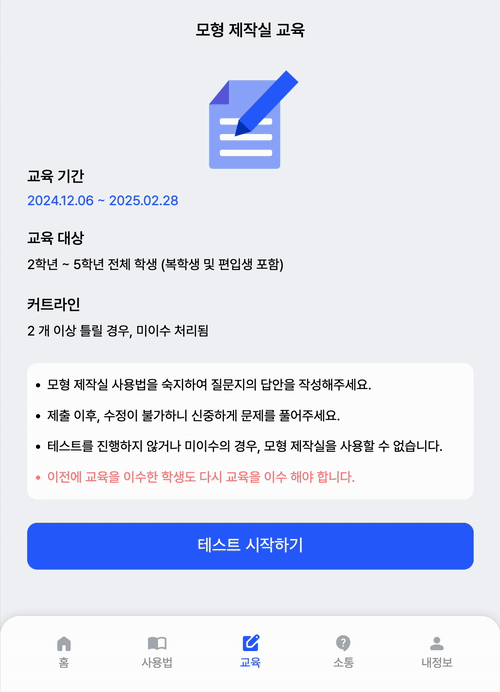 |  | 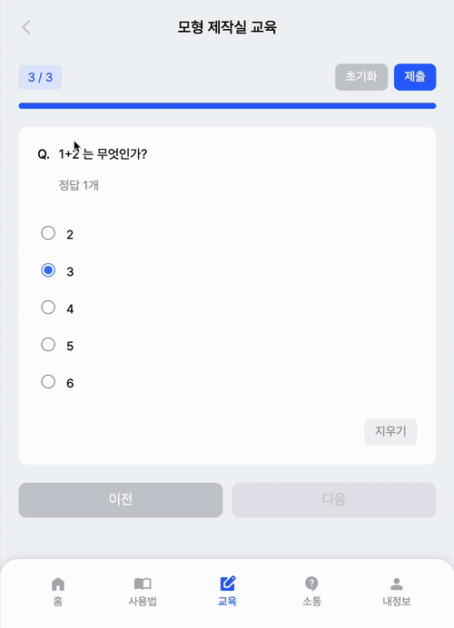 |
| - 기간, 대상, 커트라인, 주의사항을 안내<br/>- 교육 기간에 해당 시, 교육이 활성화 됨                                                                             | - 주관식, 단일 선택형, 다중 선택형 문제 출제<br/>- 답안 지우기 및 모든 답안 초기화 기능 제공                                                            | - 답안 제출 시, 학년과 교수님 정보 수정하도록 유도<br/>- 커트라인 이상 정답 시, 교육 이수로 처리 됨<br/>- 정답과 오답 안내                                                    |

<br/>

### 관리 페이지

#### 학생

| 예약                                                                                                                                | 이용 |
|-----------------------------------------------------------------------------------------------------------------------------------|----|
| 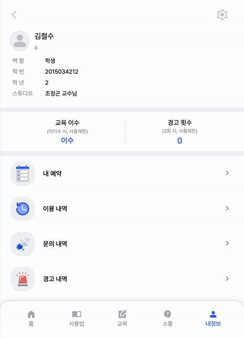 |    |
| - 유저가 예약한 기기 목록 확인 가능<br/>- 기기 별로 필터링 가능<br/>- 전체 또는 일부 선택으로 예약 취소 가능                                                             |    |

| 문의                                                                                                                          | 경고                                                                                                                        |
|-----------------------------------------------------------------------------------------------------------------------------|---------------------------------------------------------------------------------------------------------------------------|
| 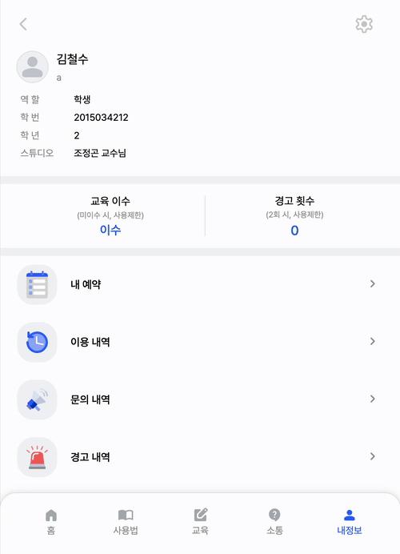 | 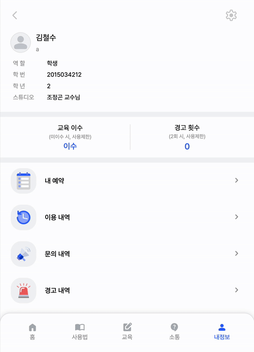 |
| - 유저의 문의 목록 확인 가능                                                                                                           | - 유저가 받은 경고 목록 확인 가능<br/>- 조교가 경고 횟수를 초기화해도 내역은 남음                                                                        |

#### 조교 및 관리자

| 예약 | 유저                                                                                                                        |
|----|---------------------------------------------------------------------------------------------------------------------------|
|    |  |
|    | - 이름 검색 기능<br/>- 학년, 경고 회수, 교육 이수여부 필터링 기능<br/>- 유저 정보 상세보기 제공<br/>- 유저 경고 부과, 유저 탈퇴, 조교 인수인계 기능                          |

| 기기                                                                                                                              | 교육 |
|---------------------------------------------------------------------------------------------------------------------------------|----|
| 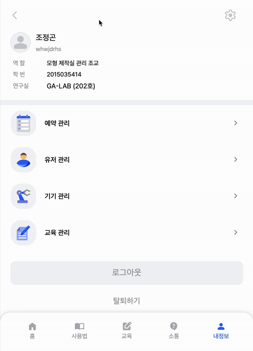 |    |
| - 레이저 커팅기 기기 추가 및 삭제<br/>- 레이저 커팅기 예약 시간 추가 및 삭제, 순서 변경<br/>- 3D 프린터 기기 추가 및 삭제<br/>- 열선 운용 개수 설정<br/>- 기기 활성화 온오프 토글 버튼 기능     |    |

<br/>
<br/>

## 9. 이슈

### 1. 토글 버튼을 빠르게 연속 클릭 시, DB의 상태와 토글 상태의 싱크가 맞지 않는 문제 해결하기

<br/>

### 2. 목록 더보기(list collapse)의 부드러운 애니메이션 적용하기

<br/>

### 3. 레이저 커팅기 시간 목록 순서 설정, 교육(퀴즈)의 문제 순서 설정에 드래그앤드롭 적용하기

<br/>

### 4. 모달 닫기 버튼이 제대로 동작하지 않는 에러 발생

<br/>

### 5. 레이저 커팅기 시간 목록 순서 설정 시, 기존 레이저 커팅기 예약이 풀려버리는 문제 해결하기

<br/>

### 6. react-helmet-async 적용하기

<br/>

### 7. 내 예약 내역 삭제 시, 쿼리 스트링 이용하기

<br/>

### 8. Toast 메시지가 페이지 이동 및 리다이렉트 시에도 표시되도록 하기

<br/>

### 9. 홈화면 공지사항 무한 롤링 구현하기

<br/>

### 10. 라이브러리 사용하지 않고 캘린더 컴포넌트 구현하기

<br/>

### 11. useForm 훅에 'mode : onChange' 설정을 했는데 실시간 추적이 안되던 문제 해결하기

<br/>

### 12. useForm 훅으로 폼을 관리하고 세션 스토리지에 저장하여 새로고침 시에도 유지하도록 하려했는데 새로고침 시, 세션이 초기화 되거나, 세션에 폼이 안 채워지는 문제 해결하기

<br/>

### 13. 도커 빌드 캐시로 인한 문제 및 AWS Cloudfront의 캐싱으로 인한 페이지 접근 시, 에러 문제 해결하기

<br/>

[//]: # (### [+ 백엔드 이슈 살펴보기]&#40;https://github.com/JeonggonCho/HEAR-BE&#41;)